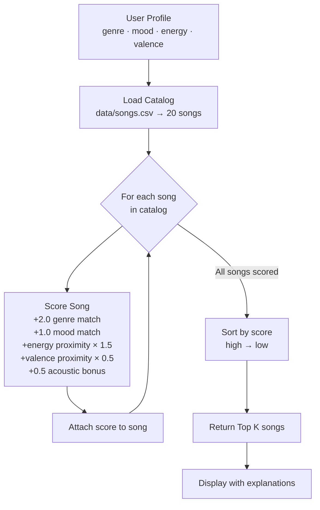
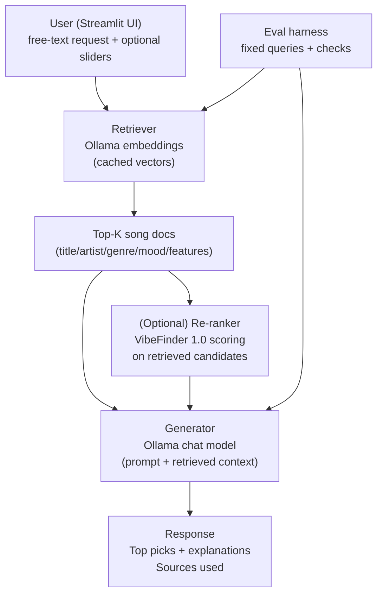
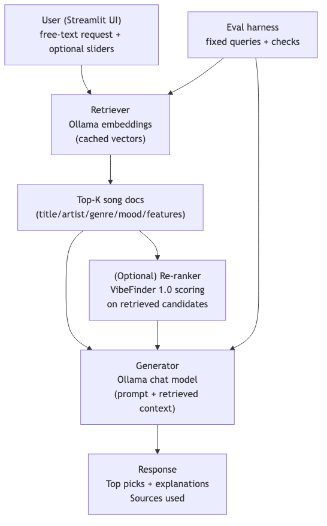
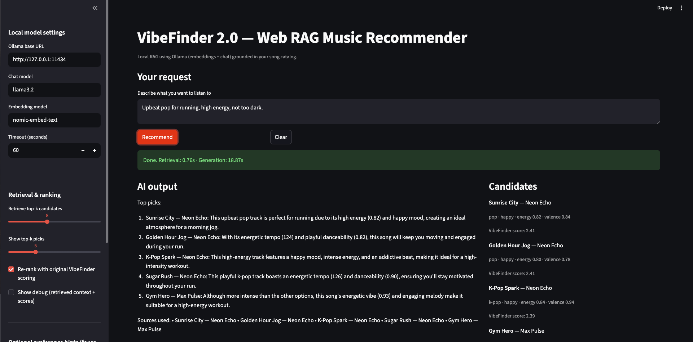
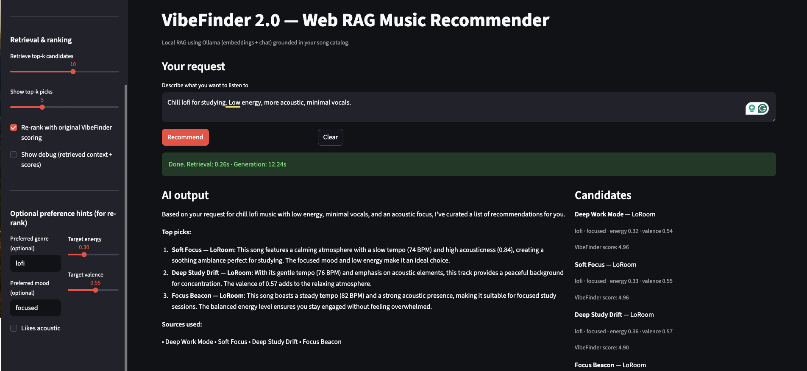
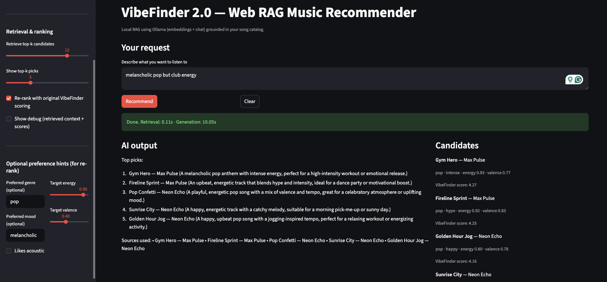

## 🎵 VibeFinder — from Scoring Simulator to Web RAG App

## Project Summary

This repo contains two connected versions of the same idea:

- **Original Modules 1–3 project (VibeFinder 1.0)**: a transparent, content-based music recommender simulation that scores every song in `data/songs.csv` against a user taste profile (genre/mood + energy/valence proximity) and returns the top picks with reasons.
- **Final project upgrade (VibeFinder 2.0)**: a **Streamlit web app** that uses **Retrieval-Augmented Generation (RAG)** with **local Ollama models** to ground recommendations in retrieved songs from the catalog, then generates a natural-language explanation and “sources used”.

Why it matters: real recommenders blend *retrieval*, *ranking*, and *explanations*. VibeFinder 2.0 makes that pipeline explicit and testable on a small dataset.

Project goals:

- Represent songs and a user "taste profile" as data
- Design a scoring rule that turns that data into recommendations
- Evaluate what the system gets right and wrong
- Reflect on how this mirrors real world AI recommenders

---

## Demo Video

Zoom recording link:
- `https://asu.zoom.us/rec/share/Zc3Z4okHHp7gEgO03-2nacENqnGLeOfQZtT1XqZiH8JgRFjPQTy0r4aMaG-A1gFL.-3G8bORKpbRzZ3oh?startTime=1777262681000`

This simulator (**VibeFinder 1.0**) builds a content-based music recommender that matches songs to a user's taste profile using features like genre, mood, energy, and valence. Given a user's preferences, it scores every song in the catalog and returns the top matches — no behavioral data or other users needed.

VibeFinder 2.0 keeps that “transparent scoring” spirit, but adds a real AI workflow: **retrieve relevant songs first**, then generate a grounded response using only that retrieved context.

---

## How The System Works

Real music platforms like Spotify recommend music in two main ways. The first is collaborative filtering — it watches what many listeners do and notices patterns like “people who liked these songs also tend to play this one.” The second is content-based filtering — it looks at the attributes of songs (fast tempo, high energy, happy mood) and finds other songs with similar features. VibeFinder starts with the content-based approach because it doesn’t require other users’ behavior data — it compares one preference profile against a catalog of song features.

**What each `Song` tracks:**
- `genre` — the broad category (pop, lofi, rock, jazz, ambient, synthwave, indie pop)
- `mood` — the emotional tone (happy, chill, intense, relaxed, focused, moody)
- `energy` — how high-powered the song feels (0.0 = very calm, 1.0 = full throttle)
- `valence` — how musically "bright" or positive the song sounds (0.0 = dark, 1.0 = uplifting)
- `tempo_bpm` — beats per minute, basically how fast it moves
- `acousticness` — how organic/unplugged it sounds vs electronic/produced
- `danceability` — how much it makes you want to move

**What the `UserProfile` stores:**
- `favorite_genre` — the genre they prefer most
- `favorite_mood` — the mood they're looking for right now
- `target_energy` — a number between 0 and 1 for how energetic they want the music
- `likes_acoustic` — whether they lean toward acoustic or produced sounds

**How the `Recommender` scores each song:**

Genre and mood use a simple match — matching genre gets the highest bonus (worth 2 points) since most people have hard genre preferences. Mood match adds 1.0 point. For numerical features like energy and valence, the scoring uses a proximity formula: the closer a song’s value is to the target, the higher it scores. Each feature gets a weight that reflects how much it matters.

**How we pick what to recommend:**

Every song in the catalog gets scored against the user profile. Then we sort all those scores from highest to lowest and return the top 5. That's the ranking step — the scoring rule tells us how good each song is, and the ranking rule decides which ones actually get shown.

**Features used in the simulation:**

| Feature | Type | Used for |
|---|---|---|
| `genre` | categorical | +2.0 pts if match |
| `mood` | categorical | +1.0 pts if match |
| `energy` | numerical | `(1 - \|target - value\|) × 1.5` |
| `valence` | numerical | `(1 - \|target - value\|) × 0.5` |
| `acousticness` | threshold | +0.5 bonus if preference aligns |

---

## Algorithm Recipe

This is the exact formula the recommender uses to score each song:

```
score = 0

if song.genre == user.favorite_genre  →  score += 2.0
if song.mood  == user.favorite_mood   →  score += 1.0

energy_proximity  = 1.0 - |user.target_energy  - song.energy|
valence_proximity = 1.0 - |user.target_valence - song.valence|

score += energy_proximity  × 1.5
score += valence_proximity × 0.5

if acoustic preference aligns with song.acousticness  →  score += 0.5
```

**Why these weights?**

- Genre gets the highest weight (2.0) because it's the hardest boundary — most people won't enjoy heavy metal just because the energy level matches what they wanted from pop.
- Energy gets 1.5 because it's the most immediately felt quality — a sleepy song in the wrong genre still feels wrong.
- Mood (1.0) is softer than genre. Sometimes the mood matters more than the genre label.
- Valence (0.5) is a subtle supporting signal. It fine-tunes which song within a genre cluster rises to the top.
- Acoustic is a small bonus rather than a scored feature — it's more of a tiebreaker.

**Data flow — how a song goes from CSV to recommendation:**



---

## VibeFinder 2.0 Architecture (Web + RAG)



PNG export (saved to `assets/`):



### Key components
- **Retriever**: embeds each song “document” and retrieves the most similar songs to the user’s request.
- **Generator**: writes the final answer but is constrained to use *only* the retrieved songs as its sources.
- **Reliability**: `src/eval_rag.py` runs predefined queries and checks output invariants (e.g., “Sources used” exists).

**Potential biases to watch for:**

- Genre dominance — because genre is worth 2.0 points, a perfect genre match with mediocre energy will almost always beat a great energy match in the wrong genre. This could bury genuinely good songs.
- Mood narrowness — the current catalog has only a handful of moods, so a user who wants "romantic" gets zero mood-match bonus on most songs.
- Acoustic skew — the bonus only fires at extremes (≥0.6 or ≤0.3), so mid-range acoustic songs never get the bump even if they'd feel right.
- Catalog blind spots — 10 of the 20 songs are pop, lofi, or rock-adjacent. Users who like classical, reggae, or blues will almost always see weaker top scores simply because fewer songs match their genre.

---

## CLI output (multi-profile)

From the project root:

```bash
python -m src.main
python -m src.main --experiment-weights   # Phase 4: halve genre weight, double energy weight
```

`main.py` prints **`Loaded songs:`**, the active **scoring mode** (baseline vs experiment), then **top 5** picks for each profile:

1. **High-Energy Pop** — happy pop, very high energy and valence  
2. **Chill Lofi** — chill lofi, low energy, likes acoustic  
3. **Deep Intense Rock** — intense rock, high energy, lower valence  
4. **Edge case** — pop + **melancholic** mood + very high energy (conflicting vibe on purpose)

For my submission, I captured terminal and UI screenshots and stored them in `assets/`.

**Sorting note:** `recommend_songs` uses `sorted(...)` on a new list of scored rows so the original `songs` catalog is never reordered. Mutating with `.sort()` would sort in place on that working list only — both approaches work; `sorted()` makes it obvious we are building a ranking copy.

**Phase 4 experiment (weights):** With `--experiment-weights`, genre matches add **1.0** instead of **2.0**, and energy proximity is multiplied by **3.0** instead of **1.5**. On *High-Energy Pop*, the ranking stayed the same in our run, but each song’s **energy** line in the reasons grew—so ties and close calls could flip on other profiles or catalogs.

---

## Getting Started

### Setup

1. Create a virtual environment (optional but recommended):

   ```bash
   python -m venv .venv
   source .venv/bin/activate      # Mac or Linux
   .venv\Scripts\activate         # Windows

2. Install dependencies

```bash
pip install -r requirements.txt
```

3. Local model setup (Ollama)

- Install Ollama
- In one terminal, run:

```bash
ollama serve
```

- Pull the default models:

```bash
ollama pull llama3.2
ollama pull nomic-embed-text
```

4. Run VibeFinder 1.0 (CLI):

```bash
python -m src.main
```

5. Run VibeFinder 2.0 (web RAG):

```bash
python -m streamlit run src/web_app.py
```

### Running Tests

Run the starter tests with:

```bash
pytest
```

You can add more tests in `tests/test_recommender.py`.

### Running the RAG evaluation harness

This runs a few fixed queries end-to-end and prints a JSON summary (pass/fail + basic stats):

```bash
python -m src.eval_rag
```

Copy the printed summary into the **Testing Summary** section below once you’ve run it locally.

---

## Sample Interactions (VibeFinder 2.0)

These are real runs from my local machine. All outputs are grounded in retrieved songs and include “Sources used”.

1) **Running / upbeat pop**
- **Input**: “Upbeat pop for running, high energy, not too dark.”
- **Settings**: retrieve top‑k = 8, show top‑k = 5, re-rank = ON



2) **Study / chill lofi (acoustic-leaning)**
- **Input**: “Chill lofi for studying. Low energy, more acoustic, minimal vocals.”
- **Settings**: retrieve top‑k = 10, show top‑k = 5, re-rank = ON, likes acoustic = ON, target energy ≈ 0.30



3) **Edge case (shows limitations)**
- **Input**: “melancholic pop but club energy”
- **Settings**: retrieve top‑k = 12, show top‑k = 5, re-rank = ON, target energy ≈ 0.90, target valence ≈ 0.40



---

## Experiments You Tried

- **Stress profiles:** Four taste dictionaries in `src/main.py` (see CLI section). The adversarial one (melancholic + high energy + pop) surfaces **Gym Hero** first because genre and energy beat mood when almost no song matches the mood label.
- **Weight shift:** `python -m src.main --experiment-weights` halves **genre** weight and doubles **energy** weight via `configure_scoring_experiment_energy_over_genre()` in `recommender.py`. Compare output to a normal run to see how sensitive rankings are.
- **Optional follow-up:** Commenting out the mood check (not the default in repo) would show how much the top five rely on the +1 mood bonus—useful if mood labels feel noisy.

Deeper write-ups: **[model_card.md](model_card.md)** (evaluation + bias) and **[reflection.md](reflection.md)** (profile-vs-profile narrative).

---

## Limitations and Risks

VibeFinder is only as good as its catalog and labels. It doesn’t understand lyrics, audio waveforms, or real listening behavior—only the hand-authored metadata and numeric features in the CSV. When the catalog has weak coverage for a vibe, retrieval returns the closest neighbors, which can feel repetitive or emotionally off.

---

## Reflection

Deeper write-ups:

- **[Model Card](model_card.md)**
- **[Reflection notes](reflection.md)**

Recommenders turn **labeled taste + numeric features** into a ranked list by adding weighted points—there is no magic, just rules you chose. This project made that visible: the same song can rank high for different “wrong” reasons if genre and energy overpower mood.

Bias shows up when the **catalog is tiny**, labels do not line up with how people talk about music, or **one feature is worth too much**. Our edge-case profile (melancholic but high energy) surfaced that: the system favored loud pop because the math rewarded genre and energy more than a missing mood match. Real apps add behavior data and guardrails; ours is a deliberate simplification. Full write-up: **[model_card.md](model_card.md)** (including process reflection and non-intended use).

---

## Testing Summary (real results)

Using `python -m src.eval_rag`:
- **5 out of 5** eval cases passed.
- The harness checks that responses include **“Sources used”** and that at least **3 retrieved song titles** appear in the output (grounding).
- **Average retrieval similarity** was **0.766** and per-case runtime ranged from **~10.48s to ~16.42s** on my machine.

One reliability bug I hit early: my evaluator originally expected sources to be formatted as dash bullets, but the model sometimes listed sources inline. I updated the evaluator to check for grounded retrieved titles instead of relying on formatting.

---

## Reflection & Ethics

The biggest limitation in VibeFinder 2.0 is still the dataset: even with an expanded catalog, it’s a small, hand-labeled CSV, so retrieval is biased toward whatever I happened to include more of (and it can’t answer vibes that don’t exist in the data). When a user asks for a rare combination like “melancholic pop but club energy,” the system tends to return the closest neighbors (high-energy pop/EDM) and explain the mismatch instead of finding a perfect match. A second limitation is that embeddings can blur genre boundaries: “hype” and “euphoric” prompts sometimes retrieve similar clusters, which can make different prompts feel repetitive.

This kind of recommender could be misused to stereotype taste (“people like you should listen to…”) or to reinforce filter bubbles. My main mitigations here are transparency and control: the UI shows candidate songs, the model must cite “Sources used,” and I’d add diversity constraints and “show me alternatives” toggles in a real product.

What surprised me in reliability testing was that my first failures were caused by my evaluator, not the model: I originally parsed sources too strictly (dash bullets only), but the model sometimes listed sources inline. Fixing that taught me that evaluation needs to be robust to formatting, and that “looks correct” isn’t the same as “passes a check.”

AI collaboration: using AI was helpful for turning the requirements into a clean pipeline (retrieval → optional re-rank → generation) and for drafting the first pass of the system prompt. A flawed suggestion was an incorrect detail about an Ollama endpoint, which produced a confusing “405 method not allowed” error until I verified the API behavior and corrected it.

---

## Loom Walkthrough Script (5–7 minutes)

**Goal**: show an end-to-end run (2–3 prompts), visible RAG behavior, and reliability/evaluation behavior.

1) **Show the repo + what it is (15–30s)**
   - Open `README.md` and point to: “VibeFinder 1.0 → VibeFinder 2.0” and the architecture diagram.

2) **Start local dependencies (15–30s)**
   - Terminal: show `ollama serve` already running (or `ollama list` / `ollama ps`).

3) **Demo prompt #1 (running pop) (60–90s)**
   - Streamlit UI: enter `Upbeat pop for running, high energy, not too dark.`
   - Click **Recommend**
   - Point to:
     - **Candidates** panel (retrieved set)
     - **Sources used** in the output

4) **Demo prompt #2 (study lofi) (60–90s)**
   - Prompt: `Chill lofi for studying. Low energy, more acoustic, minimal vocals.`
   - Point to how candidates change (more lofi/ambient) and sources are grounded.

5) **Demo prompt #3 (edge case) (45–75s)**
   - Prompt: `melancholic pop but club energy`
   - Say 1 sentence about limitations: “closest-match behavior when the catalog has weak coverage.”

6) **Show reliability/evaluation (45–75s)**
   - Terminal: run `python -m src.eval_rag`
   - Point to the summary line: **5/5 passed** and the grounding rule (“Sources used” + retrieved titles appear).

7) **Close (10–20s)**
   - Mention one improvement you’d do next: multi-source retrieval (personal notes) or diversity constraints.

---

## Notes

For the full model card and extended reflection, see `model_card.md` and `reflection.md`.

