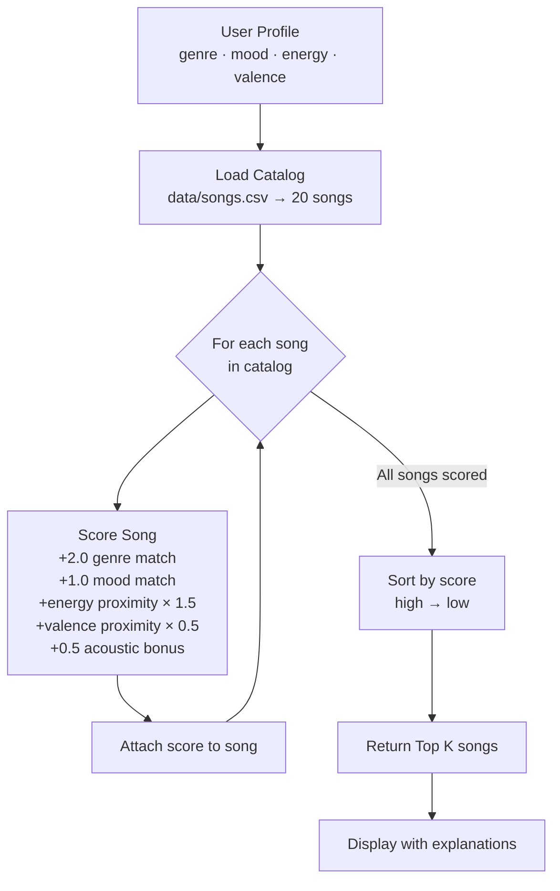

# 🎵 Music Recommender Simulation

## Project Summary

In this project you will build and explain a small music recommender system.

Your goal is to:

- Represent songs and a user "taste profile" as data
- Design a scoring rule that turns that data into recommendations
- Evaluate what your system gets right and wrong
- Reflect on how this mirrors real world AI recommenders

This simulator builds a content-based music recommender that matches songs to a user's taste profile using features like genre, mood, energy, and valence. Given a user's preferences, it scores every song in the catalog and returns the top matches — no behavioral data or other users needed.

---

## How The System Works

Real music platforms like Spotify figure out what you'll like in two main ways. The first is collaborative filtering — it watches what millions of other users do and notices patterns like "people who liked these 10 songs also tend to play this one." No one manually told it anything; it just picked up on behavior (skips, replays, playlist saves). The second is content-based filtering — it looks at the actual attributes of songs you liked (fast tempo, high energy, happy mood) and finds other songs that match that same profile. Our simulator takes the content-based approach, which means it doesn't need any other users' data — it just needs to know what the person likes and compare that against song features.

**What each `Song` tracks:**
- `genre` — the broad category (pop, lofi, rock, jazz, ambient, synthwave, indie pop)
- `mood` — the emotional tone (happy, chill, intense, relaxed, focused, moody)
- `energy` — how high-powered the song feels (0.0 = very calm, 1.0 = full throttle)
- `valence` — how musically "bright" or positive the song sounds (0.0 = dark, 1.0 = uplifting)
- `tempo_bpm` — beats per minute, basically how fast it moves
- `acousticness` — how organic/unplugged it sounds vs electronic/produced
- `danceability` — how much it makes you want to move

**What the `UserProfile` stores:**
- `favorite_genre` — the genre they prefer most
- `favorite_mood` — the mood they're looking for right now
- `target_energy` — a number between 0 and 1 for how energetic they want the music
- `likes_acoustic` — whether they lean toward acoustic or produced sounds

**How the `Recommender` scores each song:**

Genre and mood use a simple match — you either match or you don't, and matching genre gets the highest bonus (worth 2 points) since most people have hard genre preferences. Mood match adds 1.0 point. For numerical features like energy and valence, we use a proximity formula: the closer the song's value is to what the user wants, the higher it scores. A song with energy 0.82 scores higher than one at 0.4 for a user who wants 0.8. Each feature gets a weight that reflects how much it matters.

**How we pick what to recommend:**

Every song in the catalog gets scored against the user profile. Then we sort all those scores from highest to lowest and return the top 5. That's the ranking step — the scoring rule tells us how good each song is, and the ranking rule decides which ones actually get shown.

**Features used in the simulation:**

| Feature | Type | Used for |
|---|---|---|
| `genre` | categorical | +2.0 pts if match |
| `mood` | categorical | +1.0 pts if match |
| `energy` | numerical | `(1 - \|target - value\|) × 1.5` |
| `valence` | numerical | `(1 - \|target - value\|) × 0.5` |
| `acousticness` | threshold | +0.5 bonus if preference aligns |

---

## Algorithm Recipe

This is the exact formula the recommender uses to score each song:

```
score = 0

if song.genre == user.favorite_genre  →  score += 2.0
if song.mood  == user.favorite_mood   →  score += 1.0

energy_proximity  = 1.0 - |user.target_energy  - song.energy|
valence_proximity = 1.0 - |user.target_valence - song.valence|

score += energy_proximity  × 1.5
score += valence_proximity × 0.5

if acoustic preference aligns with song.acousticness  →  score += 0.5
```

**Why these weights?**

- Genre gets the highest weight (2.0) because it's the hardest boundary — most people won't enjoy heavy metal just because the energy level matches what they wanted from pop.
- Energy gets 1.5 because it's the most immediately felt quality — a sleepy song in the wrong genre still feels wrong.
- Mood (1.0) is softer than genre. Sometimes you're in a "chill" mood regardless of genre.
- Valence (0.5) is a subtle supporting signal. It fine-tunes which song within a genre cluster rises to the top.
- Acoustic is a small bonus rather than a scored feature — it's more of a tiebreaker.

**Data flow — how a song goes from CSV to recommendation:**



**Potential biases to watch for:**

- Genre dominance — because genre is worth 2.0 points, a perfect genre match with mediocre energy will almost always beat a great energy match in the wrong genre. This could bury genuinely good songs.
- Mood narrowness — the current catalog has only a handful of moods, so a user who wants "romantic" gets zero mood-match bonus on most songs.
- Acoustic skew — the bonus only fires at extremes (≥0.6 or ≤0.3), so mid-range acoustic songs never get the bump even if they'd feel right.
- Catalog blind spots — 10 of the 20 songs are pop, lofi, or rock-adjacent. Users who like classical, reggae, or blues will almost always see weaker top scores simply because fewer songs match their genre.

---

## CLI output (multi-profile)

From the project root:

```bash
python -m src.main
python -m src.main --experiment-weights   # Phase 4: halve genre weight, double energy weight
```

`main.py` prints **`Loaded songs:`**, the active **scoring mode** (baseline vs experiment), then **top 5** picks for each profile:

1. **High-Energy Pop** — happy pop, very high energy and valence  
2. **Chill Lofi** — chill lofi, low energy, likes acoustic  
3. **Deep Intense Rock** — intense rock, high energy, lower valence  
4. **Edge case** — pop + **melancholic** mood + very high energy (conflicting vibe on purpose)

For coursework that asks for **screenshots**, capture your terminal once per profile (four images) and paste them here or next to this section.

**Sorting note:** `recommend_songs` uses `sorted(...)` on a new list of scored rows so the original `songs` catalog is never reordered. Mutating with `.sort()` would sort in place on that working list only — both approaches work; `sorted()` makes it obvious we are building a ranking copy.

**Phase 4 experiment (weights):** With `--experiment-weights`, genre matches add **1.0** instead of **2.0**, and energy proximity is multiplied by **3.0** instead of **1.5**. On *High-Energy Pop*, the ranking stayed the same in our run, but each song’s **energy** line in the reasons grew—so ties and close calls could flip on other profiles or catalogs.

---

## Getting Started

### Setup

1. Create a virtual environment (optional but recommended):

   ```bash
   python -m venv .venv
   source .venv/bin/activate      # Mac or Linux
   .venv\Scripts\activate         # Windows

2. Install dependencies

```bash
pip install -r requirements.txt
```

3. Run the app:

```bash
python -m src.main
```

### Running Tests

Run the starter tests with:

```bash
pytest
```

You can add more tests in `tests/test_recommender.py`.

---

## Experiments You Tried

- **Stress profiles:** Four taste dictionaries in `src/main.py` (see CLI section). The adversarial one (melancholic + high energy + pop) surfaces **Gym Hero** first because genre and energy beat mood when almost no song matches the mood label.
- **Weight shift:** `python -m src.main --experiment-weights` halves **genre** weight and doubles **energy** weight via `configure_scoring_experiment_energy_over_genre()` in `recommender.py`. Compare output to a normal run to see how sensitive rankings are.
- **Optional follow-up:** Commenting out the mood check (not the default in repo) would show how much the top five rely on the +1 mood bonus—useful if mood labels feel noisy.

Deeper write-ups: **[model_card.md](model_card.md)** (evaluation + bias) and **[reflection.md](reflection.md)** (profile-vs-profile narrative).

---

## Limitations and Risks

Summarize some limitations of your recommender.

Examples:

- It only works on a tiny catalog
- It does not understand lyrics or language
- It might over favor one genre or mood

You will go deeper on this in your model card.

---

## Reflection

Read and complete `model_card.md` and the profile comparison notes in **`reflection.md`**:

[**Model Card**](model_card.md) · [**Reflection (profile pairs)**](reflection.md)

Write 1 to 2 paragraphs here about what you learned:

- about how recommenders turn data into predictions
- about where bias or unfairness could show up in systems like this


---

## 7. `model_card_template.md`

Combines reflection and model card framing from the Module 3 guidance. :contentReference[oaicite:2]{index=2}  

```markdown
# 🎧 Model Card - Music Recommender Simulation

## 1. Model Name

Give your recommender a name, for example:

> VibeFinder 1.0

---

## 2. Intended Use

- What is this system trying to do
- Who is it for

Example:

> This model suggests 3 to 5 songs from a small catalog based on a user's preferred genre, mood, and energy level. It is for classroom exploration only, not for real users.

---

## 3. How It Works (Short Explanation)

Describe your scoring logic in plain language.

- What features of each song does it consider
- What information about the user does it use
- How does it turn those into a number

Try to avoid code in this section, treat it like an explanation to a non programmer.

---

## 4. Data

Describe your dataset.

- How many songs are in `data/songs.csv`
- Did you add or remove any songs
- What kinds of genres or moods are represented
- Whose taste does this data mostly reflect

---

## 5. Strengths

Where does your recommender work well

You can think about:
- Situations where the top results "felt right"
- Particular user profiles it served well
- Simplicity or transparency benefits

---

## 6. Limitations and Bias

Where does your recommender struggle

Some prompts:
- Does it ignore some genres or moods
- Does it treat all users as if they have the same taste shape
- Is it biased toward high energy or one genre by default
- How could this be unfair if used in a real product

---

## 7. Evaluation

How did you check your system

Examples:
- You tried multiple user profiles and wrote down whether the results matched your expectations
- You compared your simulation to what a real app like Spotify or YouTube tends to recommend
- You wrote tests for your scoring logic

You do not need a numeric metric, but if you used one, explain what it measures.

---

## 8. Future Work

If you had more time, how would you improve this recommender

Examples:

- Add support for multiple users and "group vibe" recommendations
- Balance diversity of songs instead of always picking the closest match
- Use more features, like tempo ranges or lyric themes

---

## 9. Personal Reflection

A few sentences about what you learned:

- What surprised you about how your system behaved
- How did building this change how you think about real music recommenders
- Where do you think human judgment still matters, even if the model seems "smart"

